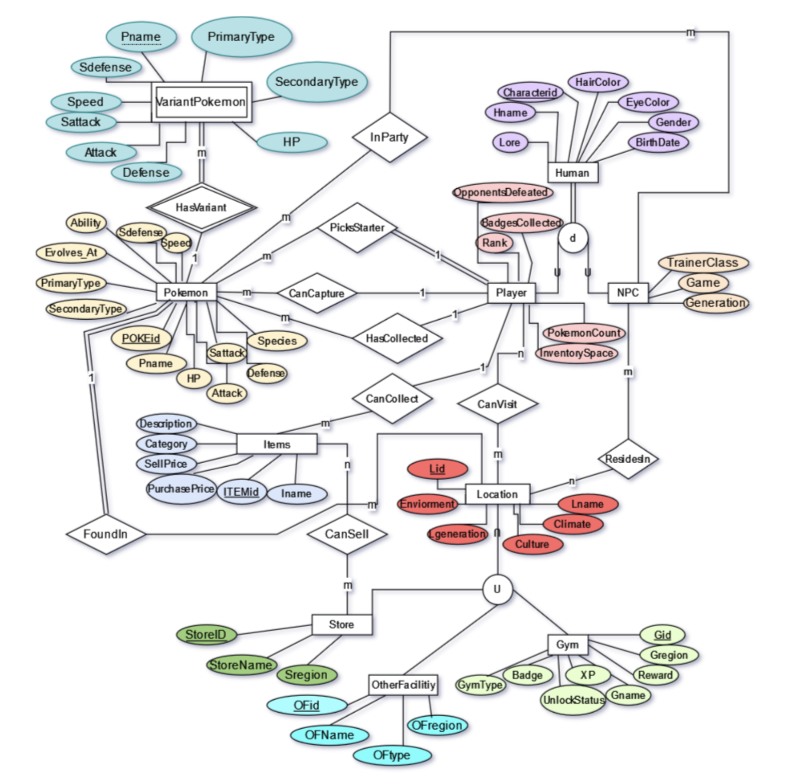

# Pokemon DB Project
This is a project created for thhe DBMS course at CSU Stan. It was created by Abel Ortiz, Trevor Meyer, and Zachary Valenzuela. 

This database was designed from the ground up.
We designed the DB initially with an ER diagram that showed all our entities, along with our attributes and relations. Soon after, we translared the table into a relational database, in BCNF, which can be found in the PokemonDbDump.sql file. That file is used to set up the entire DB used for this project. 



Given the time constraints, we were able to design a fully functional website in PHP that is able to communicate with the database. The site allows users to run any SQL query they want. It also gives a short description of the project and provides an image of the ER diagram used for making the database. We also implemented a nav bar that gives user the option to view all the DB tables and sample queries. Transactions and  

Ultimatly, this project was an excellent experience. We were given the opportunity to explore much of the SQL language and topics. We learned the important components of db design, data normalization, transactions, and security. 

Future improvements will include a stronger transaction implementation. I will also add more features to the website such as a query log. I will also fix the table feature of the navbar so data will be displayed dynamically. I would also like to make this website easier to run.

## Starting the project
1. Download the project to your desktop
2. Ensure the latest versions of php and mysql are downloaded to your machine
3. Initialize Pokemon database
- start MySql from the terminal
- login using your credetials
- create a new database called "pokemon_project" ```CREATE DATABASE pokemon_project;```
- use the database ```USE pokemon_project;```
- use the provided sql dump to populate the databse ```SOURCE Desktop/Pokemon_Db_Project/PokemonDbDump.sql;```
- test to see if the database was initialized ```SHOW tables;```
4. Ensure SQL credentials in project match your credentials
- go to ```Desktop/Pokemon_Db_Project/php_program_files```
- open ```db_connect.php```
- set ```$dbser``` and ```$dbpass``` to your MySQL credentials
4. Initialize a local php web server
- open terminal
- navigate to "php_program_files" folder ``` cd Desktop/Pokemon_Db_Project/php_program_files```
- run the php command ```php -S localhost:8000```
5. open your browser and go to localhost:8000
- website is now free to explore
